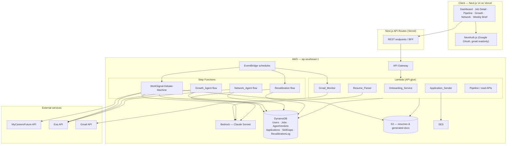
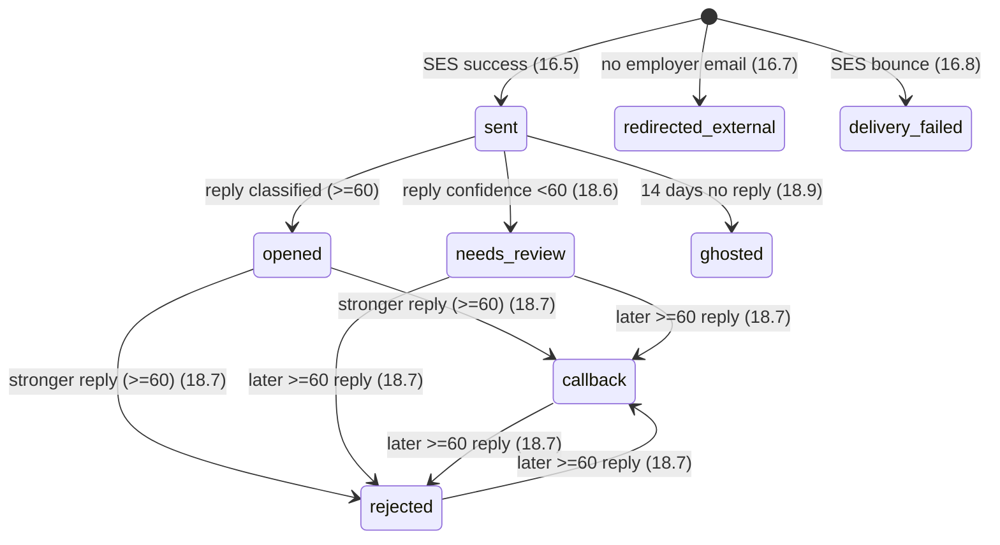
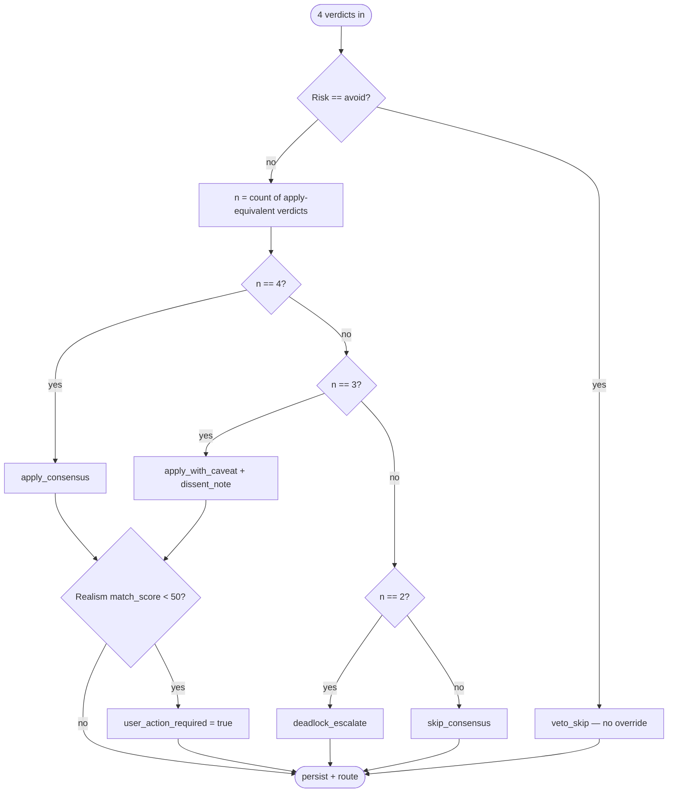

# Design Document

## Overview

WORKSIGNAL is an AI-powered, multi-agent job-search platform for early-career Singaporeans. Instead of maximising application volume, it runs a structured debate among specialised AI agents to decide whether a user should apply to each discovered job, researches company health, prepares tailored application materials, sends applications, tracks replies, and recalibrates agent behaviour weekly from real outcomes.

This design realises the 22 requirements through a layered architecture:

- A **Next.js 14 (App Router) + TypeScript + Tailwind** frontend on **Vercel**, authenticated with **NextAuth.js Google OAuth** requesting the `gmail.readonly` scope.
- A serverless **AWS backend**: **Lambda** behind **API Gateway** for synchronous API work, **Step Functions** for the agent-debate orchestration, **Bedrock** (Claude Sonnet `anthropic.claude-sonnet-4-20250514`, region `ap-southeast-1`) for all agent reasoning and generation, **DynamoDB** (on-demand) for persistence, **S3** for resumes and generated documents, **SES** for sending, **Gmail API** for inbox polling, **EventBridge** for scheduling, and **Exa** + **MyCareersFuture (MCF)** for discovery and research.

The core design intent is **decision quality over volume**: a non-negotiable pre-filter removes invalid jobs before any compute is spent, four debate agents evaluate each survivor in parallel, and a deterministic Master Orchestrator resolves their verdicts into a single auditable decision. Every decision, verdict, and outcome is persisted so the Recalibration Engine can learn over time.

### Requirements Traceability Summary

| Requirement | Primary design component(s) |
|---|---|
| 1 OAuth / Gmail auth | Auth_Service, NextAuth route, Users table |
| 2 Resume upload + parse | Onboarding_Service, Resume_Parser, S3, Bedrock |
| 3 Career stage / residency | Onboarding_Service, Users table |
| 4 Targets / priority ranking | Onboarding_Service, validation layer |
| 5 Non-negotiables + editable source of truth | Onboarding_Service, Users table |
| 6 Edge-case auto-adjustment | Onboarding_Service calibration logic, Master_Orchestrator |
| 7 Scheduled discovery | Opportunity_Scanner, EventBridge, Jobs table |
| 8 Singapore geo filter | Pre_Filter, Opportunity_Scanner |
| 9 Non-negotiable pre-filter + relaxation flow | Pre_Filter, Filter_Relaxation_Suggestion model |
| 10 Four-agent parallel debate | Debate_Engine (Step Functions Map/Parallel), 4 agents |
| 11 Verdict validity | Debate_Engine verdict validation layer |
| 12 Master resolution | Master_Orchestrator decision tree |
| 13 Decision routing | Debate_Engine Choice state |
| 14 Material generation | Debate_Engine, Bedrock, S3, Applications table |
| 15 Job detail review screen | Frontend Job Detail view |
| 16 Sending | Application_Sender, SES, external-redirect path |
| 17 Pipeline tracking | Application_Tracker, Applications table |
| 18 Inbox monitoring | Gmail_Monitor, classification, Application_Tracker |
| 19 Growth roadmaps | Growth_Agent, SkillGaps table |
| 20 Network suggestions | Network_Agent |
| 21 Weekly recalibration | Recalibration_Engine, RecalibrationLog table |
| 22 Failure handling | Debate_Engine retry/catch, Master_Orchestrator degradation |

## Architecture

### Layered Architecture



### Debate State Machine Flow

The `WorkSignal-Debate-Machine` Step Functions workflow is triggered by EventBridge every three hours per user (Requirement 7). It scans, pre-filters, fans out the four-agent debate over each surviving job, resolves a decision, and routes the outcome.

```mermaid
stateDiagram-v2
    [*] --> ScanJobs
    ScanJobs: Opportunity_Scanner (MCF API; Exa fallback)
    ScanJobs --> PreFilterMap

    state PreFilterMap {
        [*] --> PreFilter
        PreFilter: Pre_Filter (non-negotiables, geo, EP floor, FCF)
        PreFilter --> [*]
    }

    PreFilterMap --> AllFilteredChoice
    AllFilteredChoice: Choice — every job discarded?
    AllFilteredChoice --> SuggestRelaxation: yes
    AllFilteredChoice --> DebateMap: no
    SuggestRelaxation: Build Filter_Relaxation_Suggestion + notify (await approval)
    SuggestRelaxation --> [*]

    state DebateMap {
        direction LR
        [*] --> Parallel
        state Parallel {
            [*] --> Ambition
            [*] --> Realism
            [*] --> Risk
            [*] --> Opportunity
            Ambition --> [*]
            Realism --> [*]
            Risk --> [*]
            Opportunity --> [*]
        }
        Parallel --> ValidateVerdicts
        ValidateVerdicts: Validate JSON schema + score ranges
        ValidateVerdicts --> Master
        Master: Master_Orchestrator decision tree
        Master --> RouteChoice
        RouteChoice: Choice on decision
        RouteChoice --> GenerateMaterials: apply_consensus / apply_with_caveat
        RouteChoice --> Escalate: deadlock_escalate
        RouteChoice --> LogOnly: skip_consensus
        RouteChoice --> VetoLog: veto_skip
        GenerateMaterials --> [*]
        Escalate --> [*]
        LogOnly --> [*]
        VetoLog --> [*]
    }

    DebateMap --> [*]
```



Key Step Functions constructs (per PRD §8–9):

- **Map state** iterates over discovered/surviving jobs (`PreFilterMap` then `DebateMap`).
- **Parallel state** runs the four debate agents simultaneously to keep latency low (target ≤ 5s per agent).
- **Choice states** implement (a) the "all jobs filtered" branch driving the relaxation-suggestion flow, and (b) the Master Orchestrator decision routing.
- **Retry/Catch** on each Bedrock task handles rate-limits (exponential backoff, max 3) and per-agent failure (Requirement 22).

### Scheduling (EventBridge)

| Schedule | Target | Requirement |
|---|---|---|
| Every 3 hours | `WorkSignal-Debate-Machine` (scan → debate) | 7.1 |
| Every 30 minutes | `Gmail_Monitor` Lambda | 18.1 |
| Weekly (Sun 09:00 SGT) | Recalibration flow | 21.1 |

Each scheduled execution is scoped per user; the 3-hour and 14-day timers are evaluated against the user's `last_scan_at` and each application's `sent_at` respectively so that "elapsed time" semantics (Req 7.1, 18.1, 18.9) hold even if the schedule fires more frequently.

### Trust and Security Boundaries

- Gmail OAuth tokens are stored **encrypted at rest** in the Users record (Req 1.4); decryption happens only inside the Gmail_Monitor Lambda execution role.
- The S3 bucket holding resumes and generated documents is **private**; the frontend receives time-limited pre-signed URLs.
- All endpoints that read or mutate user data require an authenticated NextAuth session mapped to the Google OAuth `sub`.
- External content (MCF job text, Exa results, inbound emails) is treated as **untrusted input** and is never executed; it is only passed to Bedrock as data and validated before persistence.

## Components and Interfaces

Interfaces below are expressed as TypeScript signatures for the BFF/Lambda boundary. Agent components also have a Bedrock-prompt contract (system prompt + strict JSON output) described inline.

### Onboarding_Service

Owns profile, calibration, targets, priority ranking, and non-negotiables. Implements Requirements 2 (storage side), 3, 4, 5, and the calibration writes for 6.

```typescript
interface OnboardingService {
  uploadResume(userId: string, file: PdfFile): Promise<{ s3Key: string } | RejectError>; // 2.1, 2.3
  setCareerProfile(userId: string, stage: CareerStage, residency: ResidencyStatus,
                   switchContext?: { from: string; to: string }): Promise<void>;          // 3.1–3.4
  setTargets(userId: string, roles: string[], industries: string[], dreamCompanies: string[]): Promise<void>; // 4.1
  setPriorityRanking(userId: string, ranking: PriorityFactor[]): Promise<void | RankingError>; // 4.2–4.4
  setNonNegotiables(userId: string, nn: NonNegotiables): Promise<void | ValidationError>;       // 5.1–5.3
  editOnboarding(userId: string, patch: Partial<OnboardingState>): Promise<OnboardingState>;     // 5.4–5.5
}
```

Behavioural rules:

- **Priority ranking validation (4.3/4.4):** the submitted list must be a permutation of exactly the six factors `{salary, growth, balance, brand, purpose, stability}`. Any omission or duplication is rejected with a message naming the offending factors; nothing is persisted.
- **Min-salary validation (5.3):** must be a positive number.
- **Source-of-truth semantics (5.4/5.5):** onboarding is fully editable post-setup. On save, the Onboarding_Service writes the new values and stamps `onboarding_version`/`updated_at`; the Pre_Filter and all agents always read the latest persisted values, so every subsequent scan/debate uses the most recent configuration. No in-flight debate reuses stale values once a new version is committed.
- **Calibration auto-adjustment (Req 6):** on profile save the service derives and stores derived fields:
  - `fresh_grad` → `agent_weights.realism_threshold = 70`.
  - `senior` → `agent_weights.realism_threshold = 85`.
  - `need_sponsorship` + financial-services not in target industries → `non_negotiables.min_salary` floor = 5600.
  - `need_sponsorship` + financial-services in target industries → floor = 6200.
  - `career_switcher` is recorded so the Master_Orchestrator weights transferable skills (6.5).
  - When the user-entered min salary exceeds the EP floor, the higher value is kept; the EP floor is a *minimum*, enforced additionally by the Pre_Filter (9.3).

### Auth_Service

NextAuth.js Google provider; implements Requirement 1.

```typescript
interface AuthService {
  beginSignIn(): OAuthRedirect; // requests scopes: openid email profile gmail.readonly  (1.1)
  onCallback(profile: GoogleProfile, tokens: OAuthTokens): Promise<SessionUser>; // 1.2–1.5
}
```

Rules:

- Requests `gmail.readonly` (1.1). On success, creates/retrieves the Users record keyed by Google `sub` (1.2) and stores email + display name (1.3).
- If Gmail scope granted, the refresh/access token is **encrypted** and stored as `gmail_oauth_token` (1.4). If the user declines the Gmail scope, sign-in still completes and `inbox_monitoring_available = false` is recorded (1.5).
- On OAuth failure, returns an authentication-error and creates **no** Users record (1.6).

### Resume_Parser

Bedrock-backed extraction; implements Requirement 2 (parse side).

```typescript
interface ResumeParser {
  parse(s3Key: string): Promise<ParsedProfile | ParseFailure>; // 2.2, 2.4
}
interface ParsedProfile {
  current_role: string; years_experience: number; skills: string[];
  education: string; university: string;
}
```

Reads the PDF from S3, calls Bedrock with an extraction prompt, and validates the returned JSON. On failure it returns `ParseFailure` so the Onboarding_Service can prompt the user for manual entry (2.4).

### Opportunity_Scanner

Job discovery (distinct from the debate-stage Opportunity_Agent); implements Requirements 7 and 8.3.

```typescript
interface OpportunityScanner {
  scan(userId: string): Promise<DiscoveredJob[]>; // 7.1, 7.4
}
```

Rules:

- Queries the MCF API (`api.mycareersfuture.gov.sg/v2/jobs`) using the user's target roles/industries (7.1) once 3 hours have elapsed since `last_scan_at`.
- Persists each job's company, role title, salary range, description, posting date, source URL, and employer contact email into the Jobs table (7.2).
- Updates `last_scan_at` when the scan completes (7.3).
- On MCF error/timeout, falls back to Exa-based discovery for that scan (7.4).
- Every Exa research query appends the term `Singapore` (8.3).

### Pre_Filter

Non-negotiable hard filter; implements Requirements 8 and 9. Runs inside the Map state **before** the debate.

```typescript
interface PreFilter {
  evaluate(job: DiscoveredJob, user: UserConfig): FilterResult; // pure function
}
type FilterResult =
  | { pass: true }
  | { pass: false; violated: NonNegotiableKey[] };
```

Deterministic checks (a job passes only if it violates **none**):

1. `salary_max >= user.min_salary` (9.1).
2. Employment type ∈ user's selected types (9.1).
3. Work arrangement compatible with preference (9.1).
4. Location is Singapore; a fully-remote job is retained only if the employer is SG-based or the role specifies an SG time zone (8.1, 8.2).
5. No custom dealbreaker matched (9.1).
6. If `need_sponsorship`: `salary_max >= EP_Salary_Floor` (5600, or 6200 for financial services) (9.3).
7. If `need_sponsorship`: job indicates EP sponsorship available (9.4).

On any violation the job is discarded with **no user-visible record**, but a discarded-job entry may be written to an internal analytics log (9.2). The Pre_Filter is a pure function so it is directly property-testable.

**Too-strict relaxation flow (9.5–9.8):** the surrounding Map/Choice logic detects when a run discarded *every* discovered job. WORKSIGNAL then notifies the user (9.5) and derives a `Filter_Relaxation_Suggestion` from the jobs scanned in that run — e.g. "lowering min salary from 6000 to 5500 would surface 8 of the 12 scanned jobs" (9.6). The suggestion is presented but **not applied**: non-negotiables stay unchanged while it awaits approval (9.8), and the adjustment is applied only after explicit user approval (9.7).

### Debate_Engine

The Step Functions workflow coordinating the four agents and the Master Orchestrator; implements Requirements 10, 11, 13, 14, and the orchestration parts of 22.

```typescript
interface DebateEngine {
  runDebate(job: Job, user: UserConfig): Promise<DebateResult>; // 10.1, 10.6
  validateVerdict(raw: unknown, agent: AgentName): Verdict | InvalidVerdict; // 11.1–11.4
  route(decision: Decision, ctx: DebateContext): Promise<void>; // 13.1–13.5
  generateMaterials(job: Job, instructions: MasterDecision): Promise<Materials>; // 14.1–14.6
}
```

Responsibilities:

- Invokes the four agents in **parallel** for each surviving job (10.1) and stores all four verdicts in AgentVerdicts keyed by `(job_id, user_id)` (10.6).
- **Verdict validation (11):** a verdict is accepted only if it is valid JSON conforming to that agent's schema (11.1) and every numeric score is within 0–100 inclusive (11.2). Non-conforming output marks that agent's evaluation as failed and triggers agent-failure recovery (11.3). Invalid output detected after completion is logged while preserving the completed status (11.4).
- **Routing (13):** Choice state maps each Decision to a next step — generate materials + queue for review (13.1), save + notify for deadlock (13.2), log-only for skip (13.3), log + never-surface for veto (13.4). `act_now` + ≥2 other apply-equivalent verdicts places the queued application at the **top** of the review queue (13.5).
- **Material generation (14):** applies the Master's resume instructions and stores the resume in S3 (14.1); applies the cover-letter angle and stores text with the application record (14.2); injects work-authorisation status for `need_sponsorship` users (14.3); falls back to the base resume on customisation or S3 failure (14.4, 14.5); still queues for review with available documents on any generation failure (14.6).

### The Four Debate Agents

Each agent is a Bedrock task (Claude Sonnet) with a fixed system prompt (verbatim from PRD §6) and a strict JSON output contract validated by the Debate_Engine. Implements Requirement 10.2–10.5, 10.7.

```typescript
type AgentName = "ambition" | "realism" | "risk" | "opportunity";

interface AmbitionVerdict {
  verdict: "apply" | "skip"; ambition_score: number; // 0–100
  reasoning: string; key_argument: string;
}                                                                   // 10.2
interface RealismVerdict {
  verdict: "apply" | "skip" | "caution"; match_score: number;
  key_gaps: string[]; work_life_flags: string[];
  reasoning: string; key_argument: string;
}                                                                   // 10.3
interface RiskVerdict {
  verdict: "safe" | "caution" | "avoid"; risk_score: number;
  red_flags: { flag: string; source: string; severity: "high"|"medium"|"low" }[];
  glassdoor_score: number | null;
  reasoning: string; key_argument: string;
}                                                                   // 10.4
interface OpportunityVerdict {
  verdict: "act_now" | "monitor" | "no_advantage"; urgency_score: number;
  timing_factors: string[]; reasoning: string; key_argument: string;
}                                                                   // 10.5, 10.7
```

- **Ambition_Agent** evaluates career-ceiling lift; biased toward applying.
- **Realism_Agent** evaluates realistic callback probability against the user's per-user match threshold (70/80/85 from calibration); flags WLB red flags and gaps. A flagged gap feeds the Growth_Agent trigger (19.1).
- **Risk_Agent** researches the company via Exa (financial health, layoffs, Glassdoor, culture, EP sponsorship history) and returns red flags with sources. `avoid` triggers the Master veto (12.1). On empty Exa results it returns `caution` noting insufficient data (22.2).
- **Opportunity_Agent** evaluates timing/urgency; for `need_sponsorship` users it includes the MCF listing duration relative to the FCF 14-day rule in `timing_factors` (10.7).

**Apply-equivalent mapping** (used by the Master): Ambition `apply`; Realism `apply` (and, by configuration, `caution` is treated as *not* apply-equivalent — it counts as a dissent); Risk `safe`; Opportunity `act_now` or `monitor`. `Opportunity = no_advantage` and Realism `skip`/`caution` are not apply-equivalent. This mapping is defined once and shared by orchestrator code and tests.

### Master_Orchestrator

Bedrock-assisted but **deterministically gated**: the decision class is computed by pure code from the verdicts (so it is testable and reproducible); Bedrock is used only to author the human-readable summary, resume instructions, and cover-letter angle. Implements Requirement 12 and the routing inputs to 13, plus 6.5.

```typescript
interface MasterOrchestrator {
  resolve(verdicts: VerdictSet, user: UserConfig): MasterDecision; // 12.1–12.8
}
interface MasterDecision {
  decision: "apply_consensus" | "apply_with_caveat" | "skip_consensus"
          | "deadlock_escalate" | "veto_skip";
  summary: string; resume_instructions?: string; cover_letter_angle?: string;
  agents_for: AgentName[]; agents_against: AgentName[];
  dissent_note?: string; user_action_required: boolean; // 12.6 sets this for Realism<50
}
```

Decision-tree logic (evaluated in this order):

1. **Veto (12.1):** if Risk verdict = `avoid` → `veto_skip`; no override permitted.
2. Otherwise let `n` = number of apply-equivalent verdicts among the four:
   - `n == 4` → `apply_consensus` (12.2).
   - `n == 3` → `apply_with_caveat`, recording the dissenting agent's concern (12.3).
   - `n == 2` → `deadlock_escalate` (12.4).
   - `n <= 1` → `skip_consensus` (12.5).
3. **Realism floor (12.6):** if Realism `match_score < 50` and the resolved decision is apply-equivalent (`apply_consensus`/`apply_with_caveat`), set `user_action_required = true` — explicit user confirmation is required before any application proceeds.
4. **Apply outputs (12.7):** for any apply-equivalent decision, output resume instructions + cover-letter angle.
5. Persist decision, summary, supporting agents, opposing agents, dissent note to AgentVerdicts (12.8).
6. **Career-switcher weighting (6.5):** when the user is `career_switcher`, the orchestrator's Bedrock summary/instructions prompt weights transferable skills more heavily; the deterministic count is unchanged, but the apply-equivalent mapping for Realism may use the lowered new-field threshold supplied in calibration.

The "Realism `caution` counts as dissent" rule together with the veto rule are the two invariants exercised most heavily by property tests.

### Growth_Agent

Background flow; implements Requirement 19.

```typescript
interface GrowthAgent {
  onSkillGapFlagged(userId: string, skill: string): Promise<void>; // 19.1 trigger at >=3 distinct jobs
  buildRoadmap(userId: string, skill: string): Promise<SkillGapRoadmap>; // 19.2–19.4
}
```

Triggered when the Realism_Agent flags the same skill gap across **three or more distinct jobs** for a user (19.1). It searches Exa for courses, projects, certifications, and SG events (19.2), produces a four-week roadmap where each week has an action, resource URL, cost, time estimate, and resource type (19.3), and stores it in SkillGaps with the skill, times flagged, and projected match-score improvement (19.4).

### Network_Agent

Background flow; implements Requirement 20.

```typescript
interface NetworkAgent {
  onCompanyInterest(userId: string, company: string): Promise<void>; // 20.1 trigger at >=2 applications
  buildSuggestions(userId: string, company: string): Promise<NetworkSuggestionSet>; // 20.2–20.4
}
```

Triggered when a user sends **two or more applications to the same company** (20.1). Searches Exa for people, alumni from the user's university, community members, and upcoming SG events (20.2). Returns **at most three** connection suggestions ordered **alumni → community → cold** (20.3), each with a personalised outreach draft (20.4).

### Recalibration_Engine

Weekly background flow; implements Requirement 21.

```typescript
interface RecalibrationEngine {
  runWeekly(userId: string): Promise<RecalibrationLogEntry>; // 21.1–21.4, 21.6
}
```

Fetches the previous 7 days' applications and current statuses (21.1), computes per-agent accuracy by comparing each agent's verdict to the resulting status (21.2), updates warranted thresholds in `agent_weights` recording prior value/new value/reason (21.3), stores metrics + performance + adjustments in RecalibrationLog and the generated brief when generation succeeds (21.4). If the user has **zero callbacks across the three most recent recalibrations**, it performs an emergency recalibration and alerts the user (21.6).

### Application_Sender

Implements Requirement 16.

```typescript
interface ApplicationSender {
  send(applicationId: string, editedCoverLetter?: string): Promise<SendResult>; // 16.1–16.8
}
```

- If an employer contact email exists: sends via SES with the customised resume attached and cover-letter text in the body (16.1). Recipient = employer contact; reply-to = user's email; user is CC'd (16.4). Send works regardless of the original Decision class (16.2) or the application's current state (16.3).
- On success, Application_Tracker creates a record with status `sent`, recipient, send timestamp, and email thread id (16.5).
- If **no employer email** exists: WORKSIGNAL shows a redirect link to the job's source URL and makes the resume + cover letter available for manual submission (16.6); Application_Tracker records status `redirected_external` with the source URL and redirect timestamp (16.7).
- If SES reports a bounce: status set to `delivery_failed` and the user is notified (16.8).
- Edited cover-letter text from the Job Detail screen is used verbatim when present (15.6).

### Application_Tracker

Implements Requirements 16.5/16.7/16.8 (record creation) and 17.

```typescript
interface ApplicationTracker {
  create(record: NewApplication): Promise<Application>;
  list(userId: string): Promise<Application[]>;   // 17.1, retry on failure 17.2
  getDebate(applicationId: string): Promise<DebateResult>; // 17.4
  applyClassification(applicationId: string, c: Classification): Promise<void>; // 18.5–18.7, 18.9
}
type ApplicationStatus =
  | "sent" | "opened" | "callback" | "rejected" | "ghosted"
  | "redirected_external" | "needs_review" | "delivery_failed";
```

The pipeline view shows company, role, send date, and status (17.1); on load failure it retries silently in the background (17.2). User-facing pipeline statuses are constrained to the enum above (17.3 plus the new states introduced by Requirements 16 and 18). Selecting an application shows its original debate (17.4).

### Gmail_Monitor

Implements Requirement 18.

```typescript
interface GmailMonitor {
  poll(userId: string): Promise<void>;                       // 18.1, 18.8
  matchApplication(email: InboundEmail, apps: Application[]): MatchResult; // 18.2, 18.3
  classify(email: InboundEmail): Promise<{ label: ReplyLabel; confidence: number }>; // 18.4
}
type ReplyLabel = "acknowledgement" | "callback" | "rejection" | "other";
type MatchResult =
  | { matched: true; applicationId: string; score: number }
  | { matched: false };
```

- Polls every 30 minutes (18.1).
- **Fuzzy company matching (18.2):** determines whether an email belongs to a sent application using a weighted combination of sender domain similarity, company-name similarity, and thread id — no exact match to the original recipient address is required.
- **Role disambiguation (18.3):** when a user has multiple applications to the same company, the monitor picks the specific application using the role title referenced in the reply, the thread id, and the application thread the reply belongs to.
- **Classification + confidence (18.4):** Bedrock classifies the reply into one of the four labels with a `Classification_Confidence` 0–100.
- **Status update rules:** confidence ≥ 60 updates the application status from the classification (18.5); confidence < 60 sets `needs_review` (18.6); a later ≥60 reply overwrites an existing classified status regardless of earlier classification (18.7).
- **Token expiry (18.8):** expired Gmail OAuth → prompt re-authorisation and queue the poll for retry.
- **Ghosting (18.9):** no reply for 14 days → status `ghosted` (handled by Application_Tracker on a timer).

## Data Models

All tables use **DynamoDB on-demand** billing in `ap-southeast-1`. Resumes and generated documents live in a **private S3 bucket**; tables hold S3 keys, not blobs. Schemas mirror PRD §13 with additions required by Requirements 5, 9, 16, and 18 (called out as **NEW**).

### Table: Users

Partition key: `user_id` (Google OAuth `sub`).

```json
{
  "user_id": "string",
  "email": "string",
  "name": "string",
  "resume_s3_key": "string",
  "career_stage": "fresh_grad | early_career | mid_career | senior | career_switcher",
  "residency_status": "citizen | pr | ep_holder | need_sponsorship",
  "career_switch_context": { "from": "string", "to": "string" },
  "profile": {
    "current_role": "string", "years_experience": "number", "skills": ["string"],
    "education": "string", "university": "string",
    "target_roles": ["string"], "target_industries": ["string"],
    "dream_companies": ["string"],
    "priority_ranking": ["salary","growth","balance","brand","purpose","stability"]
  },
  "non_negotiables": {
    "min_salary": "number",
    "employment_type": ["full_time","contract","part_time"],
    "work_arrangement": "any | hybrid_remote | fully_remote",
    "custom": ["string"],
    "ep_sponsorship_required": "boolean"
  },
  "agent_weights": {
    "ambition_threshold": "number (default 70)",
    "realism_threshold": "number (default 80; 70 fresh_grad, 85 senior)",
    "risk_max_acceptable": "number (default 70)",
    "opportunity_urgency_boost": "boolean (default true)"
  },
  "gmail_oauth_token": "encrypted_string",
  "inbox_monitoring_available": "boolean",          // NEW — Req 1.5
  "onboarding_version": "number",                    // NEW — Req 5.5 source-of-truth tracking
  "updated_at": "timestamp",                         // NEW — Req 5.5
  "created_at": "timestamp",
  "last_scan_at": "timestamp"
}
```

### Table: Jobs

Partition key: `job_id`; GSI on `user_id` for per-user scans.

```json
{
  "job_id": "string", "user_id": "string",
  "company": "string", "role_title": "string",
  "salary_min": "number", "salary_max": "number",
  "jd_text": "string", "posted_at": "timestamp",
  "source_url": "string", "employer_email": "string | null",
  "employment_type": "string", "work_arrangement": "string",  // for Pre_Filter
  "location": "string", "ep_sponsorship_signal": "boolean",    // NEW — Req 8/9 filtering
  "mcf_listing_days": "number",                                // NEW — Req 10.7 FCF
  "scanned_at": "timestamp"
}
```

### Table: AgentVerdicts

Partition key: `verdict_id`; attributes for `(job_id, user_id)` lookups via GSI.

```json
{
  "verdict_id": "string", "job_id": "string", "user_id": "string",
  "ambition":   { "verdict": "apply|skip", "score": 0, "reasoning": "", "key_argument": "" },
  "realism":    { "verdict": "apply|skip|caution", "score": 0, "reasoning": "", "key_argument": "", "gaps": [], "wlb_flags": [] },
  "risk":       { "verdict": "safe|caution|avoid", "score": 0, "reasoning": "", "key_argument": "", "red_flags": [], "glassdoor_score": null },
  "opportunity":{ "verdict": "act_now|monitor|no_advantage", "score": 0, "reasoning": "", "key_argument": "", "timing_factors": [] },
  "master_decision": {
    "decision": "apply_consensus|apply_with_caveat|skip_consensus|deadlock_escalate|veto_skip",
    "summary": "", "agents_for": [], "agents_against": [], "dissent_note": "",
    "user_action_required": false,                  // NEW — Req 12.6 Realism<50
    "resume_instructions": "", "cover_letter_angle": ""
  },
  "agent_failures": ["string"],                     // NEW — Req 11.3/22.4 record unavailable verdicts
  "created_at": "timestamp"
}
```

### Table: Applications

Partition key: `application_id`; GSI on `(user_id, company)` to drive Network_Agent (20.1) and role disambiguation (18.3).

```json
{
  "application_id": "string", "user_id": "string", "job_id": "string", "verdict_id": "string",
  "company": "string", "role_title": "string",       // denormalised for pipeline + disambiguation
  "customised_resume_s3_key": "string",
  "customisation_applied": "boolean",                // NEW — Req 14.4/14.5 fallback record
  "cover_letter_text": "string",
  "sent_at": "timestamp",
  "recipient_email": "string | null",
  "email_thread_id": "string | null",
  "status": "sent | opened | callback | rejected | ghosted | redirected_external | needs_review | delivery_failed", // NEW values — Req 16, 18
  "redirect_source_url": "string | null",            // NEW — Req 16.7 external redirect
  "redirected_at": "timestamp | null",               // NEW — Req 16.7 redirect timestamp
  "status_updated_at": "timestamp",
  "classification_confidence": "number"
}
```

Status enum (full set, Req 17.3 extended by 16 and 18):



Reply-status progression is **sequential and overridable**: any later reply classified with confidence ≥ 60 replaces the current status regardless of the prior classification (18.7); a `< 60` reply yields `needs_review` (18.6).

### Table: SkillGaps

Partition key: `(user_id, skill)`.

```json
{
  "user_id": "string", "skill": "string",
  "times_flagged": "number", "first_flagged_at": "timestamp",
  "flagged_job_ids": ["string"],                    // NEW — Req 19.1 distinct-job counting
  "roadmap": {
    "weeks": [ { "week": 1, "action": "", "resource_url": "", "cost": "", "time_hours": 0, "type": "course|project|event|certification" } ],
    "projected_match_improvement": "74% -> 89%",
    "networking_opportunities": [ { "name": "", "date": "", "url": "", "type": "event" } ]
  },
  "status": "identified | roadmap_created | in_progress | completed"
}
```

`flagged_job_ids` is a set so the trigger fires on **distinct** jobs (≥3), not repeated flags of the same job.

### Table: RecalibrationLog

Partition key: `recalibration_id`; GSI on `(user_id, week_of)`.

```json
{
  "recalibration_id": "string", "user_id": "string", "week_of": "date",
  "metrics": { "applications_sent": 0, "callbacks": 0, "rejections": 0, "ghosted": 0, "callback_rate": 0 },
  "agent_performance": {
    "ambition": { "correct": 0, "incorrect": 0 }, "realism": { "correct": 0, "incorrect": 0 },
    "risk": { "correct": 0, "incorrect": 0 }, "opportunity": { "correct": 0, "incorrect": 0 }
  },
  "adjustments_made": [ { "agent": "", "parameter": "", "old_value": "", "new_value": "", "reason": "" } ],
  "emergency": "boolean",                            // NEW — Req 21.6 zero-callback emergency run
  "brief_text": "string", "created_at": "timestamp"
}
```

### Filter_Relaxation_Suggestion (NEW — Req 9.5–9.8)

Stored against the user (e.g. a `relaxation_suggestions` collection or item attribute) and surfaced in the dashboard. It is a **proposal with an explicit approval state**; it never mutates non-negotiables until approved.

```json
{
  "suggestion_id": "string",
  "user_id": "string",
  "created_at": "timestamp",
  "scan_run_id": "string",                  // the run in which all jobs were discarded (9.6)
  "target_non_negotiable": "min_salary | employment_type | work_arrangement | custom | ep_related",
  "current_value": "any",
  "proposed_value": "any",
  "rationale": "string",                    // e.g. "8 of 12 scanned jobs would pass"
  "evidence_job_ids": ["string"],
  "approval_state": "pending | approved | rejected | expired"
}
```

Lifecycle: created `pending` (9.6) → non-negotiables remain unchanged while `pending` (9.8) → on user approval, transition to `approved` and only then apply the change to the user's non-negotiables (9.7). User may reject, leaving non-negotiables untouched.

## Master Orchestrator Decision Tree

The verdict schemas above (AmbitionVerdict, RealismVerdict, RiskVerdict, OpportunityVerdict) are the inputs. The Master Orchestrator's decision **class** is pure and deterministic; Bedrock only authors prose for apply outcomes.



Apply-equivalent mapping (single source of truth shared by code and tests):

| Agent | Apply-equivalent values | Not apply-equivalent |
|---|---|---|
| Ambition | `apply` | `skip` |
| Realism | `apply` | `skip`, `caution` |
| Risk | `safe` | `caution`, `avoid` (`avoid` ⇒ veto) |
| Opportunity | `act_now`, `monitor` | `no_advantage` |

Fast-track (routing input, Req 13.5): when Opportunity = `act_now` and at least two other agents are apply-equivalent, the queued application is placed at the top of the review queue.

## Correctness Properties

*A property is a characteristic or behavior that should hold true across all valid executions of a system — essentially, a formal statement about what the system should do. Properties serve as the bridge between human-readable specifications and machine-verifiable correctness guarantees.*

WORKSIGNAL contains substantial **pure logic** amenable to property-based testing: the priority-ranking validator, the calibration derivation, the Pre_Filter, the verdict-schema validator, the Master Orchestrator decision tree, the reply-status progression, the disambiguation logic, and the background-agent triggers. These are deterministic functions over large input spaces where input variation reveals edge cases, so property-based testing is the right tool. The infrastructure layers (OAuth, MCF/Exa/Gmail/SES/S3 I/O, Bedrock generation) are validated with integration and example tests instead (see Testing Strategy).

### Property 1: Priority ranking accepted iff exact permutation

*For any* submitted list of priority factors, the Onboarding_Service accepts and persists it **if and only if** the list is a permutation containing each of the six factors `{salary, growth, balance, brand, purpose, stability}` exactly once; any list that omits or duplicates a factor is rejected, leaves the stored ranking unchanged, and the returned message names the missing or duplicated factors.

**Validates: Requirements 4.3, 4.4**

### Property 2: Calibration derivation is correct

*For any* user configuration, the derived Realism match threshold equals 70 when career stage is `fresh_grad`, 85 when `senior`, and the derived minimum salary floor equals 5600 SGD when residency is `need_sponsorship` and target industries exclude financial services, and 6200 SGD when residency is `need_sponsorship` and target industries include financial services.

**Validates: Requirements 6.1, 6.2, 6.3, 6.4**

### Property 3: Minimum salary must be positive

*For any* submitted minimum monthly salary, the Onboarding_Service persists it if and only if the value is a positive number; non-positive values are rejected.

**Validates: Requirements 5.3**

### Property 4: Onboarding edits are the source of truth

*For any* sequence of saved onboarding versions for a user, any subsequent Pre_Filter evaluation or agent evaluation reads the values from the most recently saved version and never an earlier one.

**Validates: Requirements 5.4, 5.5**

### Property 5: Pre_Filter never passes a non-negotiable violation

*For any* (job, user configuration) pair, if the Pre_Filter returns `pass`, then the job violates none of the user's non-negotiables — minimum salary, employment type, work arrangement, Singapore location (including the fully-remote SG-employer/SG-timezone exception), custom dealbreakers, and, when residency is `need_sponsorship`, the applicable EP salary floor and EP-sponsorship availability; and if the job violates any non-negotiable, the Pre_Filter discards it with no user-visible record.

**Validates: Requirements 8.1, 8.2, 9.1, 9.2, 9.3, 9.4**

### Property 6: Exa queries are Singapore-scoped

*For any* research query the Opportunity_Scanner issues to Exa, the emitted query string contains the term `Singapore`.

**Validates: Requirements 8.3**

### Property 7: Non-negotiables change only on explicit approval

*For any* sequence of Filter_Relaxation_Suggestion lifecycle events, the user's non-negotiables remain equal to their pre-suggestion values unless and until the user explicitly approves a suggestion, after which exactly the approved adjustment is applied; suggestions in `pending` or `rejected` state never mutate non-negotiables.

**Validates: Requirements 9.7, 9.8**

### Property 8: Verdict accepted iff schema-conformant with scores in range

*For any* raw agent output and target agent, the Debate_Engine accepts it as a valid Verdict **if and only if** it is valid JSON conforming to that agent's schema and every numeric score it contains lies within 0–100 inclusive; non-conforming output is marked as a failed evaluation.

**Validates: Requirements 10.2, 10.3, 10.4, 10.5, 11.1, 11.2, 11.3**

### Property 9: Risk "avoid" is an absolute veto

*For any* set of four valid verdicts in which the Risk_Agent verdict is `avoid`, the Master_Orchestrator decision is `veto_skip`, regardless of the other three verdicts, and no input can override it.

**Validates: Requirements 12.1**

### Property 10: Decision is a total, deterministic function of the apply-equivalent count

*For any* set of four valid verdicts in which the Risk verdict is not `avoid`, the Master_Orchestrator returns exactly one decision determined solely by the number `n` of apply-equivalent verdicts: `n = 4` → `apply_consensus`, `n = 3` → `apply_with_caveat` (recording the dissenter's concern), `n = 2` → `deadlock_escalate`, and `n ≤ 1` → `skip_consensus`; the same input always yields the same decision.

**Validates: Requirements 12.2, 12.3, 12.4, 12.5**

### Property 11: Low realism forces user confirmation on apply decisions

*For any* set of four valid verdicts that resolves to an apply-equivalent decision (`apply_consensus` or `apply_with_caveat`), if the Realism_Agent match score is below 50 then the resulting decision has `user_action_required = true`.

**Validates: Requirements 12.6**

### Property 12: Fast-track ordering for act_now

*For any* resolved debate in which the Opportunity_Agent verdict is `act_now` and at least two of the other three agents are apply-equivalent, the queued application is ordered at the top of the user's review queue.

**Validates: Requirements 13.5**

### Property 13: Application status is always a single valid enum value

*For any* application produced by any send path (SES success, no-employer redirect, SES bounce) and after any sequence of reply-driven status updates, the application's status is exactly one member of `{sent, opened, callback, rejected, ghosted, redirected_external, needs_review, delivery_failed}`, and the initial status matches its creation path (employer email → `sent`, no employer email → `redirected_external`, bounce → `delivery_failed`).

**Validates: Requirements 16.5, 16.7, 16.8, 17.3**

### Property 14: Reply-status progression follows confidence rules

*For any* ordered sequence of replies associated with one application, where each reply carries a classification label and a Classification_Confidence, the application's status after processing equals the classification of the most recent reply whose confidence is 60 or above; if the most recent processed reply has confidence below 60 it yields `needs_review`; and a later reply with confidence 60 or above always overrides any earlier classification.

**Validates: Requirements 18.5, 18.6, 18.7**

### Property 15: Reply role disambiguation is correct

*For any* set of two or more sent applications to the same company that differ by role title, and any reply that references one of those roles, the Gmail_Monitor attributes the reply to the application whose role title the reply references.

**Validates: Requirements 18.3**

### Property 16: Growth_Agent triggers on three distinct jobs

*For any* sequence of skill-gap flag events for a user, the Growth_Agent is triggered for a skill if and only if that skill has been flagged across three or more **distinct** jobs; repeated flags of an already-counted job do not advance the trigger.

**Validates: Requirements 19.1**

### Property 17: Growth roadmap structure is well-formed

*For any* roadmap the Growth_Agent produces, it contains exactly four weekly entries and each entry specifies an action, a resource URL, a cost, a time estimate, and a resource type.

**Validates: Requirements 19.3**

### Property 18: Network_Agent suggestion cap and ordering

*For any* set of candidate connections the Network_Agent produces for a company, the output contains at most three suggestions and is ordered with alumni first, community members second, and cold contacts last.

**Validates: Requirements 20.3**

### Property 19: Network_Agent triggers on two applications

*For any* sequence of sent applications for a user, the Network_Agent is triggered for a company if and only if the user has sent two or more applications to that company.

**Validates: Requirements 20.1**

### Property 20: Emergency recalibration on three zero-callback weeks

*For any* history of weekly recalibrations for a user, the Recalibration_Engine performs an emergency recalibration and alerts the user if and only if the three most recent recalibrations each recorded zero callbacks.

**Validates: Requirements 21.6**

### Property 21: Bedrock retries are bounded

*For any* sequence of Bedrock rate-limit responses, the Debate_Engine issues at most three retry attempts for a single invocation.

**Validates: Requirements 22.1**

### Property 22: Degraded resolution with partial verdicts

*For any* non-empty subset of valid verdicts (with at least one agent's verdict valid and at least one unavailable), the Master_Orchestrator produces a valid decision resolved from the available verdicts and records that an agent verdict was unavailable; if that subset includes a Risk verdict of `avoid` the decision is still `veto_skip`; and *for any* empty set of valid verdicts the Debate_Engine produces no Decision and logs the failure.

**Validates: Requirements 22.4, 22.5**

## Error Handling

Error handling maps Requirement 22 and the PRD §15 failure table to concrete Step Functions and Lambda behaviour. The guiding principle is **graceful degradation**: the debate still produces usable results when an external dependency fails, and safety invariants (the Risk veto, the non-negotiable filter) are never weakened by a failure path.

| Failure | Detection | Recovery | Req / PRD |
|---|---|---|---|
| MCF API down | HTTP error / timeout from Opportunity_Scanner | Fall back to Exa-based discovery for that scan | 7.4 |
| Exa returns nothing (Risk) | Empty Exa response | Risk_Agent emits a Verdict with `verdict = caution` noting insufficient data | 22.2 |
| Bedrock rate limit (429) | Throttling exception on a Bedrock task | Step Functions `Retry` with exponential backoff, **max 3 attempts** | 22.1 |
| Step Functions timeout | Execution exceeds time limit | Alert operator; `Catch` re-runs with a **smaller batch** of jobs (reduced Map concurrency) | 22.3 |
| Invalid agent verdict | Schema/score validation fails (Property 8) | Mark that agent's evaluation **failed**; record in `agent_failures` | 11.3 |
| Invalid output after completion | Late validation detects bad output | Log invalid output; **preserve** completed status | 11.4 |
| Single agent fails after retries | ≥1 other valid verdict present | Master resolves on remaining agents; records unavailable agent; veto still enforced | 22.4 |
| All agents fail | No valid verdict for a job | **Abort** resolution for that job; log failure; **no Decision** produced | 22.5 |
| 2-2 split | Master computes `n == 2` | `deadlock_escalate` → save debate, notify user to break tie | 12.4, 13.2 |
| Resume customisation fails | Bedrock error during generation | Attach **base resume**; set `customisation_applied = false` | 14.4 |
| S3 store of generated resume fails | S3 put error | Attach **base resume**; set `customisation_applied = false` | 14.5 |
| Any material generation failure | Generation step error | Still **queue for review** with available documents | 14.6 |
| Resume parse fails | Resume_Parser returns failure | Notify user; allow **manual** profile entry | 2.4 |
| Pipeline load fails | Read error on Applications | **Silent background retry**; no user notification | 17.2 |
| Gmail token expired | OAuth error on poll | Prompt **re-authorisation**; queue the poll for retry | 18.8 |
| Reply classified < 60 confidence | Low Classification_Confidence | Set application status `needs_review` | 18.6 |
| No reply for 14 days | Timer check on `sent_at` | Set status `ghosted` | 18.9 |
| SES bounce | SES bounce notification (SNS) | Set status `delivery_failed`; notify user | 16.8 |
| No employer email | Missing `employer_email` on send | Redirect link to source URL; expose resume + cover letter; record `redirected_external` | 16.6, 16.7 |
| Zero callbacks for 3 weeks | Recalibration history check | **Emergency recalibration** + user alert | 21.6 |
| All jobs filtered in a run | Pre_Filter discards every job | Notify "filters may be too strict"; derive Filter_Relaxation_Suggestion (await explicit approval) | 9.5, 9.6, 9.7, 9.8 |

Step Functions error-handling pattern (per Bedrock task):

```
Retry:  [{ ErrorEquals: ["Bedrock.ThrottlingException"], MaxAttempts: 3, BackoffRate: 2.0, IntervalSeconds: 2 }]
Catch:  [{ ErrorEquals: ["States.ALL"], Next: "MarkAgentFailed", ResultPath: "$.error" }]
```

`MarkAgentFailed` records the agent in `agent_failures` and lets the Map iteration proceed to the Master Orchestrator, which then runs the degraded-resolution path (Property 22).

## Testing Strategy

WORKSIGNAL uses a **dual testing approach**: property-based tests verify universal correctness of the pure-logic layers, while unit/integration/snapshot tests cover concrete examples, external-service wiring, and UI.

### Property-Based Testing

PBT applies to the deterministic logic identified in the Correctness Properties. The implementation will use an established property-testing library for the target language (e.g. **fast-check** for the TypeScript BFF/agent-glue layer, and an equivalent such as **Hypothesis** if any logic is ported to Python Lambdas). Property tests are **not** implemented from scratch.

Rules:

- Each property in the Correctness Properties section maps to **exactly one** property-based test.
- Each property test runs a **minimum of 100 iterations**.
- Each test is tagged with a comment referencing its design property, format: **Feature: worksignal, Property {number}: {property_text}**.
- Generators target boundary conditions explicitly: salary exactly at the EP floor (Property 5), Realism score exactly 50 (Property 11), confidence exactly 60 (Property 14), apply-equivalent counts at every value 0–4 (Properties 9, 10), distinct vs duplicate job ids (Property 16), and 2-application boundary (Property 19).

Highest-value targets (safety-critical invariants): **Property 5** (Pre_Filter never passes a violation), **Property 9** (Risk veto is absolute), **Property 10** (decision-tree totality/determinism), and **Property 22** (degraded resolution preserves the veto).

### Unit and Example Tests

Used for specific behaviours and edge cases that are not universal:

- Auth flow branches: Gmail scope granted vs declined (1.4/1.5), OAuth failure creating no record (1.6).
- Resume non-PDF rejection (2.3) and parse-failure manual-entry fallback (2.4).
- Career-stage/residency enum selection and career_switcher from/to requirement (3.x).
- Material-generation fallbacks: customisation failure, S3 failure, still-queue-on-failure (14.4–14.6).
- Send branches: send regardless of decision class (16.2) and regardless of queued state (16.3); edited cover letter used on send (15.6).
- Filter_Relaxation_Suggestion generation trigger when all jobs discarded (9.5/9.6).
- Token-encryption round-trip (1.4).

### Integration Tests (1–3 representative examples each)

Used for external-service wiring where behaviour does not vary meaningfully with input:

- Opportunity_Scanner against mocked MCF (success + error→Exa fallback) verifying stored fields and `last_scan_at` (7.x).
- Debate_Engine parallel fan-out + verdict persistence to AgentVerdicts (10.1, 10.6).
- SES send path: recipient/reply-to/CC/attachment headers and bounce→`delivery_failed` (16.1, 16.4, 16.8).
- Gmail_Monitor poll + fuzzy company match scoring against mocked inbox (18.1, 18.2).
- Bedrock classification call shape (18.4) and resume/cover-letter generation (14.1–14.3).
- Recalibration weekly fetch/compute/store (21.1–21.5).

### UI / Component Tests

- Snapshot and component tests for the Job Detail hero screen debate cards, decision summary, previews, and action bar (15.1–15.5).
- Pipeline rendering and silent background retry (17.1, 17.2, 17.4).
- Growth, Network, and Weekly Brief views (19.5, 20.5, 21.5).

## Design System and Screen Inventory

### Design System (PRD §12.1)

A clean, professional **Linear/Notion aesthetic**.

- **Typography:** `Inter` (weights 400/500/600/700) for UI; `JetBrains Mono` for data/numbers.
- **Brand:** Indigo-600 `#4F46E5`; brand-light `#EEF2FF`.
- **Backgrounds:** primary `#FAFAFA`, card `#FFFFFF`, section `#F5F5F5`.
- **Text:** primary `#111827`, secondary `#6B7280`.
- **Agent colours:** Ambition `#DC2626` (red), Realism `#2563EB` (blue), Risk `#D97706` (amber), Opportunity `#059669` (emerald), Growth `#7C3AED` (violet), Network `#0891B2` (cyan).
- **Status colours:** callback `#10B981`, rejected `#EF4444`, waiting `#6B7280`, ghosted `#94A3B8`.
- **Motion:** the Job Detail hero screen uses **staggered card entrance animations** (≈100 ms delay per agent card) so the four debate cards animate in sequence.

### Screen Inventory (PRD §12.2)

1. **Onboarding (4 screens):** Sign in with Google → Upload resume → About you (career stage + residency) → Targets + Non-negotiables. (Req 1–6)
2. **Main Dashboard:** agent status banner (scan activity), action-needed cards, pipeline summary, Growth card, Network card, intelligence card (callback rate, recalibration), plus surfaced Filter_Relaxation_Suggestion prompts. (Req 9.5/9.6, 13)
3. **Job Detail View — hero screen:** job header, four agent debate cards (agent colours, staggered animation), Master Orchestrator decision summary, customised resume preview, editable cover-letter field, action bar (Send / Skip / Save). (Req 15, 16.6)
4. **Pipeline View:** table of Company / Role / Sent / Status with status badges; row click opens the original debate. (Req 17)
5. **Growth Roadmap View:** identified skill gap, four-week plan with linked resources, projected match-score improvement, related events. (Req 19.5)
6. **Network Suggestions View:** target company + application count, connection cards (alumni/community/cold), draft outreach messages, upcoming events. (Req 20.5)
7. **Weekly Brief / Recalibration View:** applications sent, callbacks, callback rate vs industry average, per-agent accuracy, threshold adjustments. (Req 21.5)
